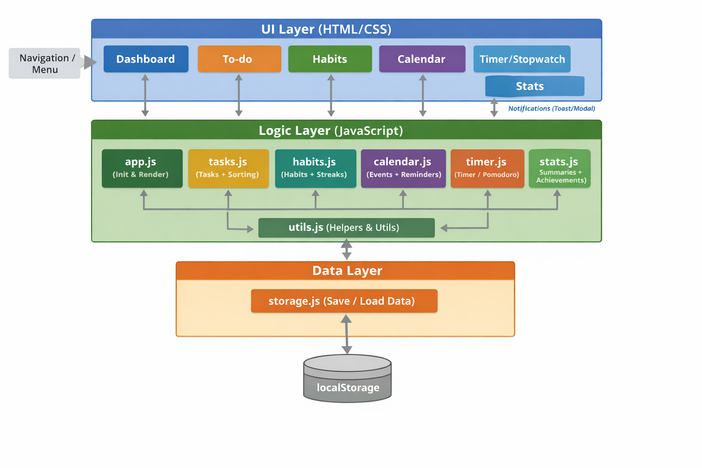
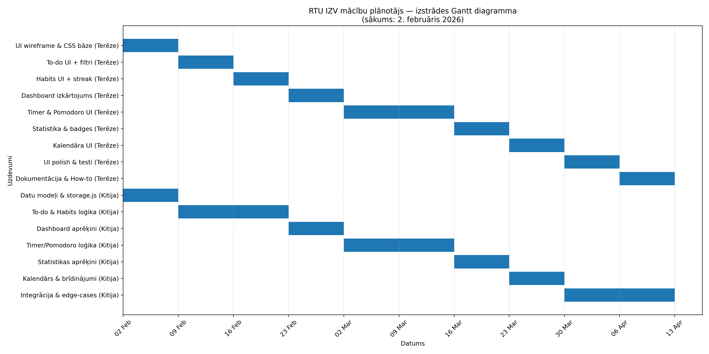

# Mācību plānotājs (Study Planner)

## Projekta apraksts
Šis projekts paredz **tīmekļa balstītas mācību plānotāja mājaslapas** izstrādi, kas kalpo kā ikdienas “vadības centrs” skolēniem un cilvēkiem ar intensīvu darba grafiku. Lietotne apvieno vairākus rīkus vienuviet: **darāmo darbu sarakstu**, **ieradumu sekotāju**, **kalendāru ar brīdinājumiem**, **taimeri un hronometru**, kā arī **statistikas sadaļu**, kas motivē uzturēt darba ritmu.

Risinājums veidots kā **client-side** web aplikācija (bez servera), un visa loģika darbojas pārlūkā, izmantojot **JavaScript**. Datu saglabāšanai tiek izmantots **localStorage**, lai lietotāja uzdevumi un ieradumi nepazustu pēc lapas aizvēršanas.

Projektā tiek apvienota lietotāja saskarnes izstrāde, datu struktūru un algoritmu izstrāde, lietojamības principi un motivējošu mehānismu (progresa joslas, streak, sasniegumi) ieviešana.

**Projektu izstrādā:**  
Kitija Kampiņa  
Terēze Luīze Kīne  

---

## Projekta mērķis
Izstrādāt tīmekļa vietni, kas:
- palīdz lietotājam **plānot un izpildīt** uzdevumus ar termiņiem un prioritātēm,
- ļauj veidot un uzturēt **ikdienas ieradumus** ar sēriju (streak) uzskaiti,
- nodrošina **kalendāru** svarīgiem notikumiem un termiņiem,
- piedāvā **fokusa rīkus** (taimeris/pomodoro un hronometrs),
- automātiski veido **statistiku un sasniegumus**, lai motivētu mācīties.

Sistēmai jāspēj:
- ātri pievienot uzdevumus un ieradumus,
- droši saglabāt informāciju lietotāja pārlūkā,
- nodrošināt saprotamu pārskatu par šodienu un tuvākajiem termiņiem,
- uzkrāt koncentrēšanās ilgumu un atspoguļot to statistikā,
- strādāt bez kontiem un servera (pirmajā versijā).

---

## Idejas rašanās
Ideja radās no personīgās pieredzes RTU IZV ikdienā: uzdevumu ir daudz (mājasdarbi, olimpiādes, projekti), un bez vienas ērtas vietas, kur visu apkopot, ir viegli:
- aizmirst termiņus,
- izlaist ieradumus (piem., ikdienas matemātikas uzdevumu pildīšanas praksi),
- pazaudēt pārskatu par to, kas ir svarīgākais tieši šodien.

Tāpēc mērķis ir izveidot vienotu “kontrolpaneli”, kur uzreiz redzams:
- kas jādara šodien,
- kādi ieradumi jau izpildīti,
- cik liela dienas daļa paveikta,
- cik laika veltīts mācībām.

---

## Idejas apraksts

### Projekta lietotāji
- skolēni, kas gatavojas pārbaudījumiem, olimpiādēm un konkursiem,
- studenti ar intensīvu mācību grafiku,
- cilvēki ar lielu pienākumu apjomu, kuri vēlas vienkāršu plānotāju bez sarežģītas uzstādīšanas.

### Funkcionalitāte
Sistēma sastāv no vairākām sadaļām/moduļiem:

1. **Galvenais panelis (Dashboard)**
   - šodienas uzdevumi,
   - ikdienas ieradumi (atzīmēšana ar ķeksīti),
   - progresa josla (paveikto darbu īpatsvars),
   - ātrā pievienošana (uzdevums/ieradums).

2. **Darāmo darbu saraksts (To-do)**
   - uzdevuma nosaukums,
   - priekšmets/kategorija,
   - izpildes termiņš,
   - prioritāte,
   - izpildes statuss (done/undone).

3. **Ieradumu sekotājs (Habits)**
   - ikdienas atzīme (izdarīts/neizdarīts),
   - streak skaitītājs (dienas pēc kārtas),
   - “best streak” (labākais sasniegums),
   - vēsture ar datumiem.

4. **Kalendārs**
   - notikumi, termiņi, atgādinājumi,
   - vizuāls pārskats par tuvākajām dienām/nedēļām,
   - brīdinājumi par termiņu tuvošanos.

5. **Taimeris un hronometrs**
   - parastais taimeris (countdown),
   - pomodoro režīms (koncentrēšanās + pauzes + sesiju skaits),
   - hronometrs (count-up) koncentrēšanās uzskaitei,
   - sesiju kopsavilkums un skaņas signāls beigās.

6. **Statistika**
   - nedēļas/mēneša kopējais koncentrēšanās laiks,
   - ieradumu izpildes procents,
   - dienas ar lielāko koncentrēšanās ilgumu,
   - sasniegumi (achievements), piemēram:
     - “7 dienas pēc kārtas mācījies vismaz 30 min”
     - “Longest streak”

---

## Izmantotās tehnoloģijas

- **HTML** – struktūra un izkārtojuma pamats
- **CSS** – vizuālais noformējums
- **JavaScript** – loģika, datu apstrāde, interaktīvā daļa
- **localStorage** – datu saglabāšana pārlūkā (līdz ~5MB)
- **Visual Studio Code** – koda redaktors
- **GitHub** – repozitorijs, versiju kontrole

---

## Piegādes formāts
Projekta rezultāts būs:
- tīmekļa vietne (web app), kas atverama pārlūkā,
- avota kods GitHub repozitorijā,
- dokumentācija (README + diagrammas).

Pirmajā versijā nav nepieciešama instalācija vai lietotāja konts.

---

## Risinājuma arhitektūra

### Konceptuālais modelis
Sistēma sastāv no trim galvenajiem slāņiem:

1. **UI slānis** (lietotāja saskarne)
   - Galvenais panelis
   - Darāmo darbu saraksts
   - Ieradamu sekotājs
   - Kalendārs
   - Taimeris/hronometrs
   - Statistika

2. **Loģikas slānis** (JavaScript moduļi)
   - uzdevumu kārtošana un filtrēšana
   - ieradumu streak aprēķins
   - taimera stāvokļu pārvaldība (start/pause/restart/stop)
   - statistikas aprēķini un sasniegumu ģenerēšana

3. **Datu slānis** (localStorage)
   - saglabāšana un ielāde
   - JSON serializācija/deserializācija
   - datu struktūru uzturēšana (Tasks, Habits, Events, Sessions)

### Datu plūsma (vienkāršoti)
- lietotājs veic darbību UI (piem., pievieno uzdevumu)
- JS loģika validē datus un atjaunina modeļus
- dati tiek saglabāti localStorage
- UI tiek pārzīmēts (render), atspoguļojot jaunāko stāvokli

---

---

## Izstrādes plāns (10 nedēļas)

Projekta izstrāde ir plānota 10 nedēļu laikā, pieņemot, ka pamatprasības un funkciju saraksts jau ir definēts. Darbs tiek sadalīts starp abām autorēm, lai varētu strādāt paralēli: **Kitija** primāri atbild par loģiku, datu struktūrām, arhitektūru un integrāciju (projekta “back-end” daļu pārlūkā), savukārt **Terēze** primāri atbild par lietotāja saskarni, dizainu un front-end funkcionalitātes ieviešanu.

### Lomu sadalījums
- **Kitija Kampiņa** – arhitektūras plānošana, datu modeļi, localStorage slānis, uzdevumu/ieradumu algoritmi, statistikas aprēķini, integrācija, kļūdu apstrāde, dokumentācija.
- **Terēze Luīze Kīne** – UI/UX dizains, HTML/CSS izkārtojums, komponentes, navigācija, interaktivitāte UI līmenī, vizuālie elementi (progresa joslas, kartītes), daļēja līdzdalība struktūras un plānošanas lēmumos.

---

### 1. nedēļa – Projekta pamati un kopējā struktūra
**Kitija:**
- Definē datu modeļus (Task, Habit, Event, FocusSession)
- Izveido `storage.js` (save/load helpers, atslēgu shēma, JSON serializācija)

**Terēze:**
- Izveido sākotnējo UI “wireframe” (Dashboard + sadaļas)
- Izveido sākotnējo HTML skeletu un navigācijas prototipu
- Sagatavo CSS bāzes stilu (krāsas, fonti, pogas, kartītes)

**Rezultāts:**  
Definēti datu modeļi un UI prototips.

---

### 2. nedēļa – To-do moduļa pamatfunkcijas
**Kitija:**
- Implementē To-do datu operācijas: pievienot/rediģēt/dzēst/atzīmēt
- Implementē kārtošanu: termiņš → prioritāte → alfabēts

**Terēze:**
- Stilizē uzdevumu kartītes (prioritātes vizuālās atšķirības)
- Pievieno filtru/skata režīmus (piem., “Šodien”, “Nedēļa”, “Visi”)

**Rezultāts:**  
Strādājošs To-do modulis ar datu saglabāšanu un sakārtotu attēlošanu.

---

### 3. nedēļa – "Habits" moduļa pamati + "strīku" loģika
**Kitija:**
- Izveido Habits datu struktūru ar `history`, `streak`, `bestStreak`
- Implementē “atzīmēt šodien” funkciju un streak pārrēķinu
- Izveido “dienas pārbaudes” loģiku (ja izlaista diena → reset)

**Terēze:**
- Izstrādā Habits UI: ieradumu pievienošana, dienas ķeksīši
- Izveido streak attēlojumu (skaitītājs, vizuāls indikators)
- Pielāgo Dashboard, lai rāda šodienas ieradumus

**Rezultāts:**  
Ieradumu sekotājs ar vēsturi un streak darbojas un ir redzams Dashboard.

---

### 4. nedēļa – Dashboard UI + progresa josla
**Kitija:**
- Izstrādā dienas progresa aprēķinu (izpildītie uzdevumi + ieradumi)
- Sagatavo kopsavilkuma funkcijas: “šodienas uzdevumi”, “tuvākie termiņi”

**Terēze:**
- Izveido pilnvērtīgu Dashboard izkārtojumu (kartīšu režģis)
- Implementē progresa joslas UI (vizuāli skaidri %)

**Rezultāts:**  
Atverot lapu, lietotājs redz “kas šodien jādara” + progresu.

---

### 5. nedēļa – Taimeris + progresa līnija
**Kitija:**
- Implementē taimera loģiku: start/pause/restart/stop, countdown līdz 0
- Pievieno paziņojumu loģiku un sesijas saglabāšanu `focusSessions`
- Definē taimera stāvokļu modeli

**Terēze:**
- Izveido taimera UI un vizuālo progresa līniju
- Pievieno skaņas signālu
- Izstrādā lietojamu iestatīšanas formu (minūtes/sekundes)

**Rezultāts:**  
Strādā parastais taimeris ar vizuālo progresu un sesiju saglabāšanu.

---

### 6. nedēļa – Pomodoro režīms + hronometrs
**Kitija:**
- Implementē pomodoro režīmu: sesijas, pauzes, cikli, automātiska pāreja
- Implementē hronometra loģiku + noteikumu “ieskaita tikai >= 10 min”
- Pievieno sesiju tipu un struktūru statistikai

**Terēze:**
- Izstrādā pomodoro UI (sesiju skaits, pauze, režīma izvēle)
- Izveido hronometra UI ar tādu pašu vizuālo stilu kā taimerim
- Pievieno skaidru statusa attēlojumu (“Fokuss”, “Pauze”)

**Rezultāts:**  
Pilns fokusa rīku komplekts: taimeris + pomodoro + hronometrs.

---

### 7. nedēļa – Statistika (nedēļa/mēnesis) + sasniegumi
**Kitija:**
- Aprēķina nedēļas/mēneša kopsavilkumus no `focusSessions`
- Aprēķina ieradumu izpildes % un produktīvākās dienas
- Implementē achievements noteikumus (piem., 7 dienas pēc kārtas, garākais "strīks")

**Terēze:**
- Izstrādā statistikas lapas UI (kartītes, tabulas vai mini grafiki)
- Pievieno sasniegumu nozīmītes (badges) un motivējošu tekstu piemērus (10-20 gabali)
- Pielāgo sākumlapu, lai statistika redzama augšā

**Rezultāts:**  
Statistika motivē un ir saprotama: laiks, ieradumi, sasniegumi.

---

### 8. nedēļa – Kalendārs + termiņu brīdinājumi
**Kitija:**
- Definē saglabāšanu localStorage
- Implementē termiņu/brīdinājumu noteikšanu (piem., “rīt”, “šodien”, “pēc 2 dienām”)
- Pievieno vienkāršu paziņojumu mehānismu (UI alert)

**Terēze:**
- Izstrādā kalendāra UI (mēneša/skata režīms vai vienkāršots saraksts)
- Pievieno notikumu pievienošanas/rediģēšanas formas
- Integrē brīdinājumu attēlojumu Dashboard

**Rezultāts:**  
Kalendārs darbojas un palīdz nepalaist garām termiņus.

---

### 9. nedēļa – Integrācija, testēšana un lietojamības uzlabojumi
**Kitija:**
- Integrē moduļus vienotā aplikācijas plūsmā (routing/navigation)
- Apstrādā edge-case situācijas (datu bojājumi localStorage, null vērtības)
- Pievieno vienkāršus test-scenārijus

**Terēze:**
- Veic UI pēdējos uzlaobojumus: responsivitāte, fontu hierarhija
- Uzlabo UX (mazāk klikšķu, skaidrāki teksti, tukšo stāvokļu dizains)
- Pārbauda lietojamību ar 2–3 testlietotājiem (klasesbiedri/draugi) un apkopo problēmas

**Rezultāts:**  
Lietotne ir vienota, stabila, ērta un bez kritiskām kļūdām.

---

### 10. nedēļa – Stabilizācija, dokumentācija un demonstrācija
**Kitija:**
- Sakārto koda struktūru, komentārus, README papildinājumus (arhitektūra, datu modeļi)
- Pievieno diagrammas iespējamos nākotnes uzlabojumus
- Sagatavo demonstrācijas scenāriju prezentācijai

**Terēze:**
- Noslīpē dizainu (krāsu konsekvence, ikonas, animāciju minimāls pielietojums)
- Sagatavo īsu “How to use” sadaļu lietotājiem (lietošanas instrukcija)

**Rezultāts:**  
Gatavs projekts demonstrācijai: stabila versija + saprotama dokumentācija.

---

